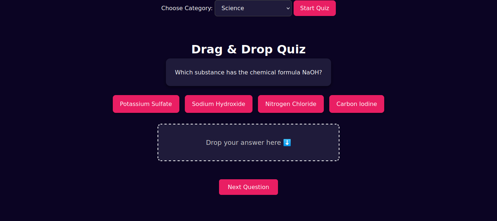

# 🎯 Drag & Drop Quiz Game

A fun, interactive quiz game built with HTML, CSS, and JavaScript — featuring a drag-and-drop interface. Users drag the correct answer into a drop zone, making learning engaging and visually intuitive.

## 🚀 Live Demo

Check out the live version here:  
👉 [https://praveenjoshwa.github.io/drag_drop_quiz_game/](https://praveenjoshwa.github.io/drag_drop_quiz_game/)

---

## 📌 Features

- 🧠 Quiz-based learning
- ✨ Smooth drag-and-drop interface
- 🎨 Clean, responsive UI
- 🎯 Instant feedback on answers
- 🔄 Next question functionality
- 🌐 Category-based questions (via Open Trivia DB)

---

## 🛠️ Technologies Used

- **HTML5**  
- **CSS3** (with custom styling)  
- **JavaScript** (DOM manipulation + drag-and-drop events)  
- **Open Trivia API** (https://opentdb.com/)

---

## 📷 Preview

---

